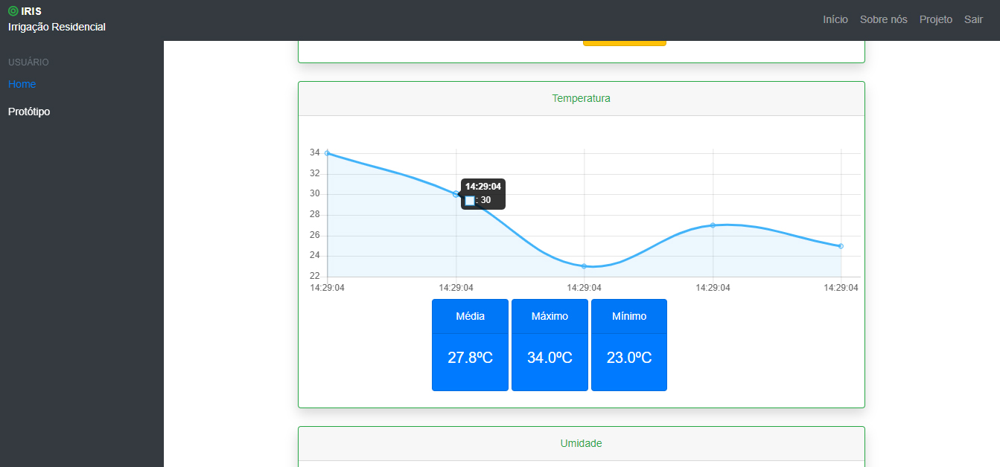

# Irrigação Residencial Inteligente Sistemática (IRIS)
Sistema Web desenvolvido para monitorar os dados referentes as características de um planta. Através de sensores, como o de temperatura do solo, temperatura do ambiente e sensor de distância, o qual é o responsável em informar a quantidade de água disponível em um reservatório d'água.

## Desenvolvedores
O projeto foi construído pelos graduandos do curso de Engenharia Elétrica fornecido pelo IFPB Campus-João Pessoa: Carlos Henrique, Mariana Barros, Mateus Gomes e Matheus Lucas.